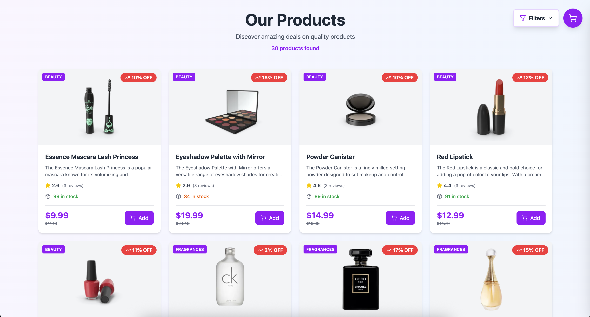
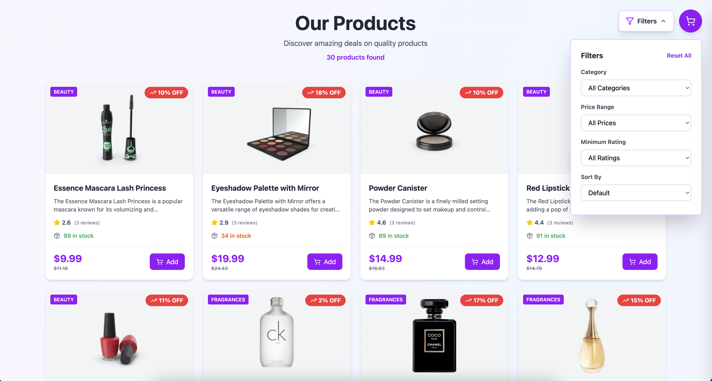
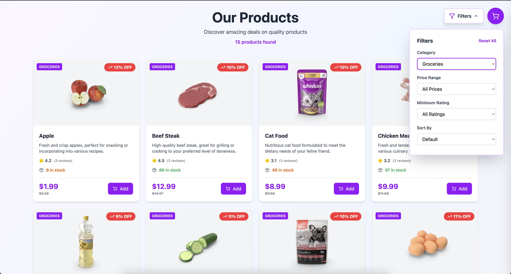
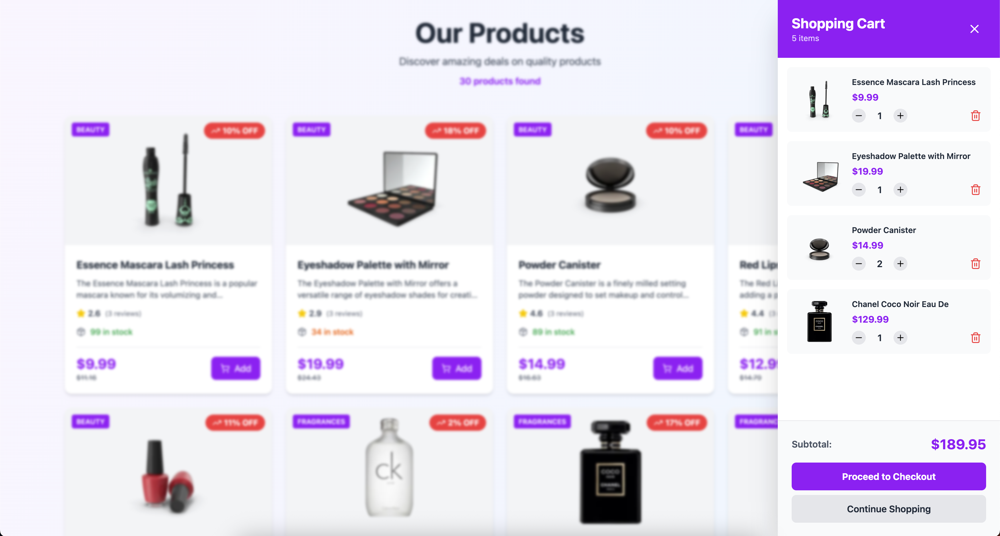
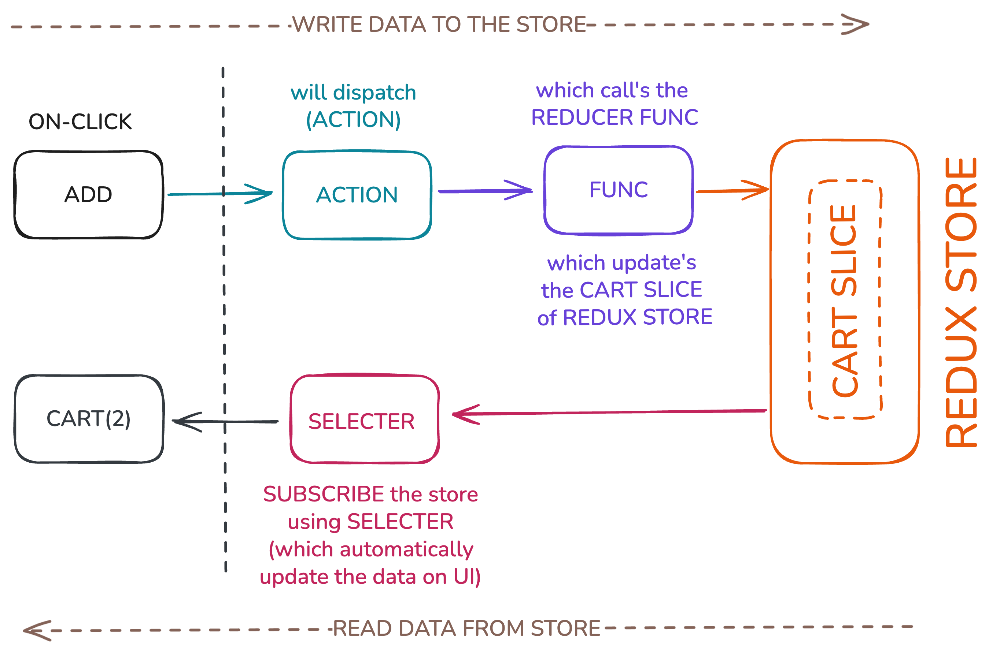
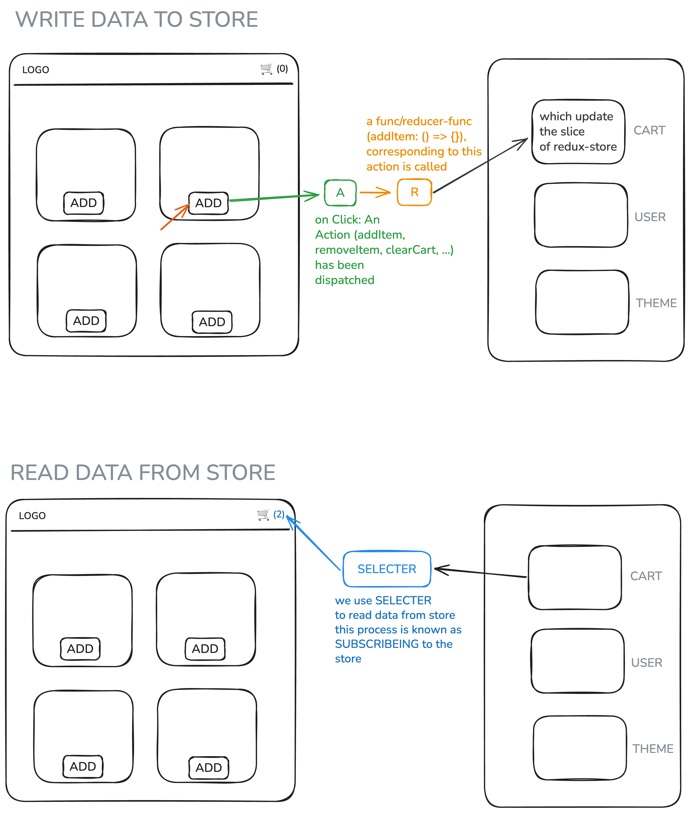

# Practice E-commerce Product Listing & Cart

A simple practice project demonstrating a responsive product listing page, category-based filtering, shopping cart functionality, and Redux state management. The UI is designed to showcase product deals, enable users to filter and sort items, and manage their shopping cart interactively.

## Features

- Product listing with discounts, ratings, stock info, and category tags.
- Filtering products by category, price, and rating.
- Add-to-cart functionality with live cart display.
- Shopping cart overlay with item quantity and total calculation.
- Redux-powered state management for cart operations.
- Responsive design featuring modern UI principles.

## Screenshots

### Product Listing Page

Displays available products, deals, rating, and stock status. Users can easily browse by category.

### Filters Sidebar

Users filter products by category, price, and minimum rating.

### Groceries Category Example

Filtering products to show only the "Groceries" category.

### Shopping Cart Display

Interactive cart overlay summarizes selected products, quantities, and total price.

### Redux Store Flow Diagram

Illustration of how Redux actions and reducers manage store slices (cart, user, theme) and how selectors subscribe to updates for rendering UI.

## Technologies Used

- React with JavaScript
- Redux Toolkit
- Tailwind CSS (for sleek, modern styling)
- Responsive layout

## Structure Overview

- **ProductListing**: Renders all products, their details, and interactable "Add" buttons.
- **FilterPanel**: Allows users to filter product list by category, price range, and rating.
- **CartDrawer**: Displays a shopping cart overlay with item management and total price.
- **Redux Store**: Manages cart state, read/write actions, and connects with UI through selectors.

## How Redux Works in This Project

1. **Writing Data to Store**:  
   On clicking "Add," an action is dispatched and handled by a reducer function to update the cart slice in the Redux store.

2. **Reading Data from Store**:  
   The UI subscribes to the Redux store with selectors to display current cart contents and automatically re-renders on cart updates.

See full schematic below:

## Getting Started

1. Clone this repo.
2. Run `npm install` to install dependencies.
3. Start the development server: `npm start`.
4. Open the app in your browser to explore the product listing, filter, and cart features.

## License

MIT — for personal practice and educational purposes.
